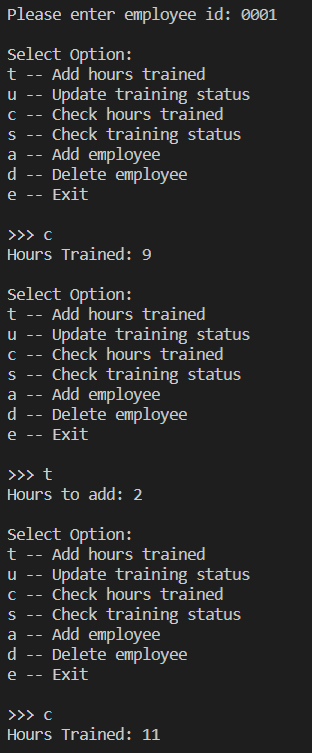
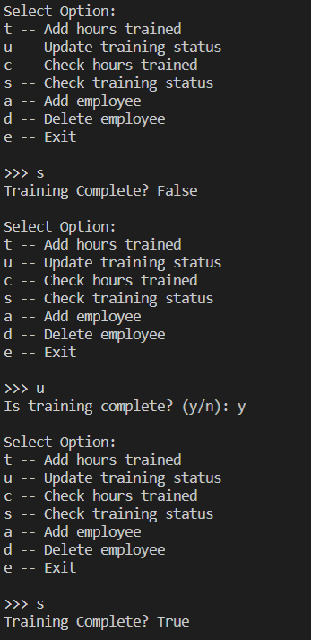
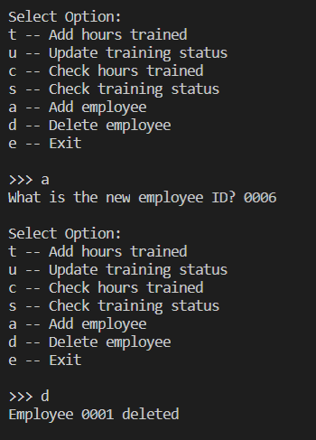

# Overview
This program is designed to use a database to track employee training.  
It has the the following functions:  
* Adding and removing training hours
* Adding and removing employees
* Checking employee status
* Updating employee status

# Development Environment
You will need to install Firebase Admin into your environment to connect to your database. You will also need the credentials for your database. You get this from your database website. It comes in a JSON file.

Below are also what I used for my env:
* Visual Studio Code  
* Python 3.8.5

# Execution
Download the program and find your JSON credentials. You will need to update the path in your program to where your own credentials are located. 

Additionally, you MUST have Firebase Admin in your environment. 

Execution of the program: `python EmployeeHours.py`  
The section displays adjusting hours.  
The second shows how to check and update training status.  
The third adds and deletes employees.

  
  
  

# Useful Websites

1. [Python Reference](https://docs.python.org/3/library/index.html)
2. [Firebase Documentation](https://firebase.google.com/docs)
3. [Firebase Admin](https://firebase.google.com/docs/reference/admin)